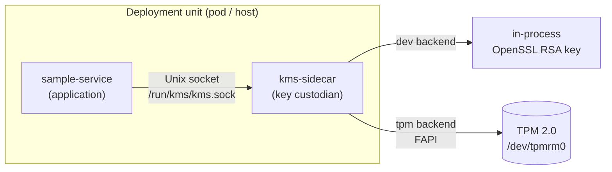
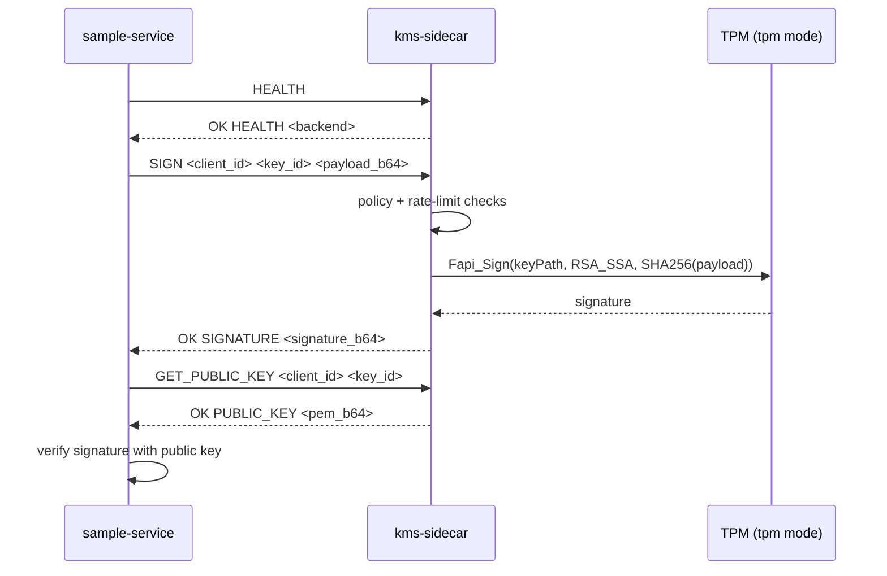

# TPM-Backed KMS Sidecar Sample (C + Autotools)

A C-only sample of the **TPM-backed KMS sidecar** pattern: an application
delegates all signing to a co-located sidecar that owns the private key. The
application never reads private key material — it only sends payloads to be
signed and receives signatures and the public key.

- `kms-sidecar` — key-management sidecar that performs signing operations.
- `sample-service` — application that uses the sidecar over a Unix socket.

## Design

### Architecture



The application and the sidecar share only a Unix domain socket. The signing
key lives entirely behind the sidecar boundary:

- In **dev** mode the key is an ephemeral RSA key generated in the sidecar
  process (for local development and CI).
- In **tpm** mode the private key never leaves the TPM; the sidecar calls the
  TPM Feature API (FAPI) `Fapi_Sign` and only ever handles the resulting
  signature and the public key.

### Signing flow



Signatures are RSA PKCS#1 v1.5 (`RSA_SSA`) over a SHA-256 digest, which the
sample-service verifies with the returned public key.

### Repository layout

```
kms-sidecar/                 Sidecar service
  include/kms_sidecar.h      Public header: error codes + entry points
  src/                       includes.h, defines.h, externs.h, globals.c, *.c
sample-service/              Sample application (same module layout)
tunnel-demo/<svc>/Dockerfile Runtime-only images (copy prebuilt binaries)
support/developer/scripts/   setup-devenv.sh, provision-tpm.sh, run-containers.sh
configure.ac, Makefile.am    Autotools build
docker-compose.yml           Compose definition (build context = repo root)
```

## Build

Build out-of-tree in a `build/` directory.

Install build dependencies (Fedora):

```bash
./support/developer/scripts/setup-devenv.sh
```

Configure and build:

```bash
mkdir -p build && cd build
autoreconf -fi ..
../configure
make -j"$(nproc)"
```

Binaries are produced at:

- `build/kms-sidecar/kms-sidecar`
- `build/sample-service/sample-service`

## Usage

### Run locally (dev backend)

```bash
export SOCKET_PATH=/tmp/kms/kms.sock
mkdir -p /tmp/kms
./build/kms-sidecar/kms-sidecar &        # BACKEND defaults to dev
SOCKET_PATH=/tmp/kms/kms.sock ./build/sample-service/sample-service
```

Expected output:

```
health response: OK HEALTH dev
sign/verify demo success for key_id=server-key
```

### Run with a TPM (tpm backend)

Provision a FAPI keystore and signing key once (idempotent; re-running is
safe). This requires a TPM at `/dev/tpmrm0` and uses `sudo` only to grant the
device access:

```bash
./support/developer/scripts/provision-tpm.sh
```

The script creates an RSA signing key at `HS/SRK/kms-signing-key`, exports its
public PEM to `keys/server-public.pem`, and writes an env file. Then run the
sidecar in TPM mode:

```bash
source ~/.local/share/hw-binding-tpm/tpm-env.sh   # BACKEND=tpm, TPM_KEY_PATH, ...
export SOCKET_PATH=/tmp/kms/kms.sock
mkdir -p /tmp/kms
./build/kms-sidecar/kms-sidecar &
SOCKET_PATH=/tmp/kms/kms.sock ./build/sample-service/sample-service
```

Expected output reports the TPM backend:

```
health response: OK HEALTH tpm
sign/verify demo success for key_id=server-key
```

Notes for virtual / VM TPMs: the provisioning script writes a FAPI config with
`ek_cert_less: yes` (no manufacturer EK certificate to verify) and a profile
using the `RSASSA` signing scheme to match the sidecar and verifier.

### Run as containers

The Dockerfiles are runtime-only and copy the host-built binaries from
`build/`, so build first (see [Build](#build)). The container images default to
the **tpm** backend, so provision the TPM first (see
[Run with a TPM](#run-with-a-tpm-tpm-backend)), then:

```bash
./support/developer/scripts/run-containers.sh
```

This builds both images with Podman (override with `ENGINE=docker`), starts the
sidecar with a shared `kms-socket` volume mounted at `/run/kms`, runs the
sample-service against it, and cleans up. It reports the sample-service exit
code (0 on success).

In TPM mode the run script passes the TPM device (`--device /dev/tpmrm0`) and
bind-mounts the provisioned FAPI keystore (`~/.local/share/hw-binding-tpm` at
`/tpm`, via `TSS2_FAPICONF=/tpm/fapi-config.container.json`) and the public-key
directory (`keys/` at `/keys`). To run without a TPM, use the dev backend:

```bash
BACKEND=dev ./support/developer/scripts/run-containers.sh
```

## Sidecar protocol

A small newline-terminated text protocol over the Unix socket:

| Request | Success response |
| --- | --- |
| `HEALTH` | `OK HEALTH <backend>` |
| `SIGN <client_id> <key_id> <payload_base64>` | `OK SIGNATURE <signature_base64>` |
| `GET_PUBLIC_KEY <client_id> <key_id>` | `OK PUBLIC_KEY <pem_base64>` |

Errors are returned as `ERR <code> <reason>` (for example `ERR 403 forbidden`,
`ERR 429 rate_limited`, `ERR 400 invalid_arguments`). The `client_id` and
`key_id` must match the sidecar policy, and requests are rate-limited.

## Configuration

`kms-sidecar` environment variables:

| Variable | Default | Description |
| --- | --- | --- |
| `SOCKET_PATH` | `/run/kms/kms.sock` | Unix socket path to listen on |
| `BACKEND` | `dev` | `dev` (in-process RSA) or `tpm` (FAPI) |
| `POLICY_CLIENT_ID` | `sample-service` | Allowed client identifier |
| `POLICY_KEY_ID` | `server-key` | Allowed key identifier |
| `RATE_LIMIT_PER_MIN` | `120` | Max signing/public-key requests per minute |
| `TPM_KEY_PATH` | `HS/SRK/kms-signing-key` | FAPI key path (tpm mode) |
| `TPM_PUBLIC_PEM` | `/keys/server-public.pem` | Public key PEM served in tpm mode |
| `TSS2_FAPICONF` | _(unset)_ | FAPI config file used in tpm mode |

The binary defaults `BACKEND` to `dev`; the container image and
`docker-compose.yml` override it to `tpm`.

`sample-service` environment variables:

| Variable | Default | Description |
| --- | --- | --- |
| `SOCKET_PATH` | `/run/kms/kms.sock` | Sidecar socket to connect to |
| `KMS_CLIENT_ID` | `sample-service` | Client identifier sent to the sidecar |
| `KMS_KEY_ID` | `server-key` | Key identifier to sign/verify with |
| `SAMPLE_MESSAGE` | `hello-from-sample` | Message to sign and verify |

## Error codes

Both programs return `0` on success and a non-zero `uint32_t` code on failure
(also printed as `0x%08X`). Ranges:

- `kms-sidecar`: `0x00001001`–`0x00001010` (e.g. `KMS_ERR_CONFIG`,
  `KMS_ERR_SOCKET_BIND`, `KMS_ERR_TPM_SIGN`, `KMS_ERR_TPM_INIT`).
- `sample-service`: `0x00002001`–`0x0000200C` (e.g. `SAMPLE_ERR_SOCKET_CONNECT`,
  `SAMPLE_ERR_KMS_SIGN`, `SAMPLE_ERR_VERIFY`).

See [kms-sidecar/include/kms_sidecar.h](kms-sidecar/include/kms_sidecar.h) and
[sample-service/include/sample_service.h](sample-service/include/sample_service.h)
for the full list.
